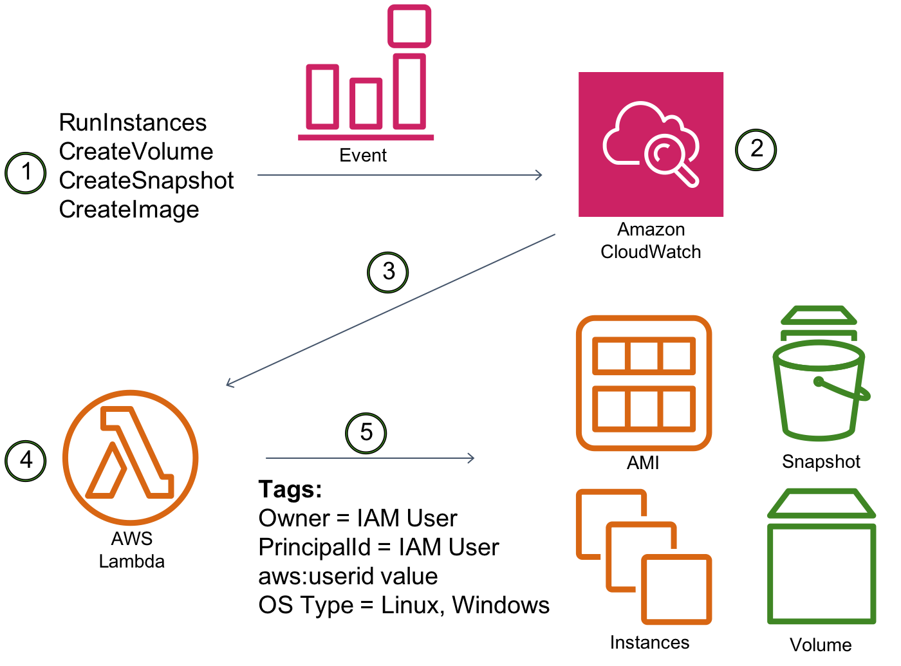
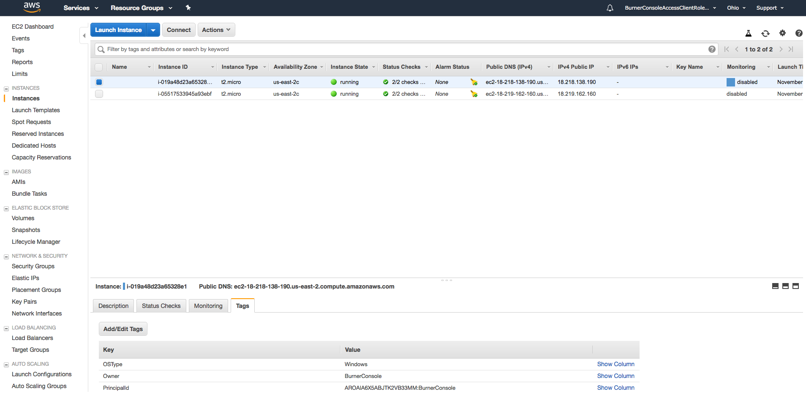

Asset Management
================

Knowing your environment is a key factor in driving your vulnerability program. After all, you want to know where vulnerabilities increase your attack surface and you also want to avoid the risk of an unknown asset introducing vulnerabilities to your environment.

The journey starts with planning on:

1. How you want to identify your assets in AWS?
	* In this module we will use tags to identify and classify our AWS resources using <a href="https://aws.amazon.com/lambda/" target="_blank">Lambda</a> and <a href="https://docs.aws.amazon.com/AmazonCloudWatch/latest/events/WhatIsCloudWatchEvents.html" target="_blank">CloudWatch Events</a> to automaticlly tag new EC2 instances as they are launched manually or by Auto Scaling.
2. How do you track your assets on AWS?
	* We will use Resource Data Sync to gather inventory data in an S3 bucket which we can monitor and analyze. Then you will see how Resource Groups can be used to organize, manage and automate tasks on large numbers of resources at one time.

**AWS Service/Feature Coverage**:

* CloudWatch
* Lambda
* EC2
* Resource Groups

## Automatically Tag Amazon EC2 Resources

Tags are the building blocks of cloud resource reports and a key element of a cloud governance framework. Organizations that are most effective in their use of tags typically create business-relevant tag groupings to organize their resources along technical, business, and security dimensions.

In this exercise, you will automatically tag EC2 resources created by Auto Scaling or launched manually in response to API Events using CloudWatch Events. This solution can be used by central IT teams in an organization to automatically tag EC2 resources created by their users for cost management and security purposes. The AutoTag function will Tag the instances with:

1. Owner: IAM User
2. PrincipalId: IAM User aws:userid value.
3. OS type: Linux, Windows (This is useful in typical integrations with on-premise CMDBs)

The solution here consists of a lambda function that monitors for CloudTrail API events from EC2 and Autoscaling service for the appropriate events. On receiving the event the Lambda function processes the event info and extracts the user identity fields to tags EC2 instances and related resources. The lambda function creates tags with key of “Owner” and value of “username” which is the user id of the IAM user that launched the EC2 instances or the Autoscaling group.

### Deploy the solution

??? info "Click here if you're running this individually in your own AWS Account"
    Launch the CloudFormation stack below to setup the Auto Tagging Solution:

    Region| Deploy
    ------|-----
    US East 2 (Ohio) | 

    1. Click the **Deploy to AWS** button above (right click and open in a new tab).  This will automatically take you to the console to run the template.  

    2. Click **Next** on the **Specify Template** section.

    3. On the **Specify Details** step click **Next**.

    4. Click **Next** on the **Options** section.
    5. Finally, acknowledge that the template will create IAM roles under **Capabilities** and click **Create**.

    This will bring you back to the CloudFormation console. You can refresh the page to see the stack starting to create. Before moving on, make sure the stack is in a **CREATE_COMPLETE**.

### The solution in action

Now that you have deployed the required automation infrastructure, deploy two new EC2 instances - One Windows 2016, one Amazon Linux 2 and validate that tagging works.

Launch without a keypair since we are only validating that the autotagging works.

Similarly for the Windows Instance we can see the AutoTag automation in action

!!! note "Take note of the value for the Owner Tag for your EC2 Instances while in the console"

Now that you know you can tag resources with a Lambda function in response to events, you can apply the same logic to other resources such as Amazon Relational Database Service (RDS) databases or S3 buckets.

Additionally, tags are useful in custom billing reports to project costs and determine how much money each individual owner is spending. You can activate the Owner tag in the billing console from the Cost Allocation Tags of your billing console to include it in your detailed billing reports. For more information, see <a href="https://docs.aws.amazon.com/awsaccountbilling/latest/aboutv2/cost-alloc-tags.html" target="_blank">Applying Tags</a>

## Using AWS Systems Manager Inventory with Tags

Next, we want to analyze our inventory based on tags and Resource Data Sync.

**Creating a Resource Group**

You can use resource groups to organize your AWS resources. Resource groups make it easier to manage and automate tasks on large numbers of resources at one time. This guide shows you how to create and manage resource groups in AWS Resource Groups.

To work with resource groups on the AWS Management Console home

1. Sign in to the AWS Management Console and go to AWS Systems Manager.
2. On the navigation bar under **Application Management**, choose **Resource Groups**.
3. On the Resource Groups page click **Create a resource group**
4. Select AWS::EC2::Instance with the Key-Value pair of Owner and the owner name of the instances you want to group together. Typically this might be an application-ID or layer in the stack such as Web Server, App Servers, etc.
5. Enter a Group name for the resources you are creating a group for. Suggested name would be something like prod-Application-xyz, dev-BusinessUnit-abc.

	

6. Click **Create Group**. You can now find your group under the Saved Resource Groups in the Navigation bar.

## Takeaway

Tags are a great way to organize AWS resources in the AWS Management Console. You can configure tags to be displayed with resources and can search and filter by tag. By default, the AWS Management Console is organized by AWS service. However, the **Resource Groups** tool allows customers to create a custom console that organizes and consolidates AWS resources based on one or more tags or portions of tags. Using this tool, customers can consolidate and view data for applications that consist of multiple services and resources in one place.

**Naming Convention Recommendations**

It is recommended that tag names follow the form: *“orgname:source:tag-name”*, consisting of the following components:

* *“orgname:” prefix* :
	To clearly differentiate Org-defined tags from tags defined by AWS, or required by third-party tools that the Org may employ

* *“source:” component* :
	Which will only be used for tag values sourced from an integration with a data source such as the Org’s Configuration Management Database (CMDB) via automation

* *“tag-name”* :
	Which will use a hyphen character ("-") to separate words within the name

**Required Tags**

The tags listed below are based on numerous AWS Professional Services engagements on AWS resource governance with enterprise customers with across a large variety of applications and products. The following tags have been identified, as a starting point for organizations looking to enhance governance through tagging. These tags should be included as inputs or preset values in CloudFormation templates.

| Tag | Description |
| ------------ | ------------ |
Name | Standard AWS tag, displayed in the AWS Management Console.
orgname:entity | Identifies whether the resource is for the Organization, for the Business unit, or shared.
orgname:charge-code | Identifies the method by which costs will be charged back to the resource consumer. For example, there could be four request type values: “cmdbid-application”, “bu-product”, “project”, or “direct-request”.
orgname:aws-budget-name | Identifies the AWS Budget name for the Charge Code.
orgname:environment-type | Identifies whether the resource is part of a production or non-production type of environment.
orgname:resource-owner-email | Identifies the email address for the individual or group that owns the resource.

**References**

For more details on tagging strategies see <a href="https://aws.amazon.com/answers/account-management/aws-tagging-strategies/" target="_blank">AWS Tagging Strategies</a>
