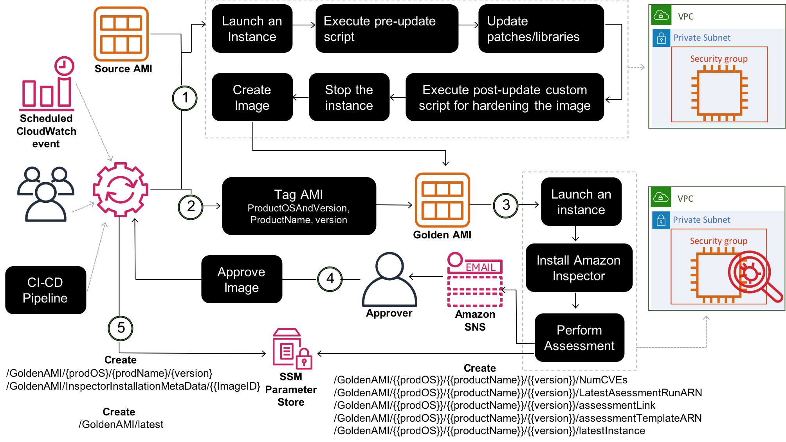
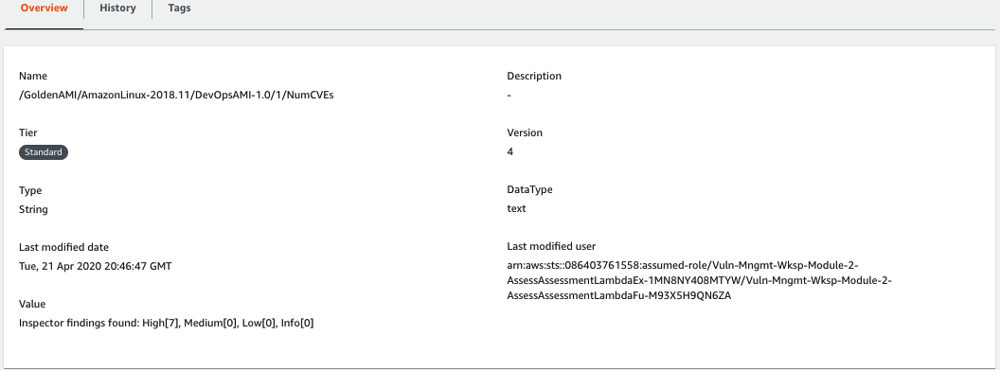

AMI Factory
===========

In a typical enterprise scenario, a cloud team is responsible for providing the core infrastructure services. This team owns providing the appropriate AWS environment for the many development teams and approved AMIs that include the latest OS updates, hardening requirements, and required third-party software agents.

## Prerequisites for this section

Terminate your instances from Module 1

## AMI Catalog Decisions

AMI design options fall along a spectrum of deployment simplicity in relation to deployment flexibility. The simplest AMIs are fully baked and purpose-built to deploy a complete running instance, including the installation and configuration of all required software. However, this approach limits flexibility, as a fully baked AMI can only be used to deploy a single instance or a farm of identical instances. The most flexible AMIs include only minimal configurations and software before then dynamically installing the required packages on first boot. This approach trades simplicity for flexibility as each instance must be properly bootstrapped before it can function as intended.

The ideal AMI design depends largely on the constraints of the workload. When considering which option is right for your organization, keep the following questions in mind:

* How quickly do you need to be able to recover a failing instance or add additional compute capacity?
* Does the workload’s baseline stay static for a relatively long period?
* Does your server configuration require manual provisioning or configuration?
* Do you need to minimize the complexity of deploying resources to both AWS and on-premises environments?
* Are there existing server provisioning tools or processes that you are trying to align with AWS?

In this exercise, we will build out the scripts needed to configure the AMI as CIS level 1 compliant, validate that the AMI is actually CIS compliant with Amazon Inspector and look for vulnerabilities from the CVE database. We are going with the JeOS (just enough Operating System) option for AMI design.

## AMI Pipeline

Here's the workflow diagram of the golden AMI pipeline:

## Design Choices

We use an AWS Systems Manager (SSM) document to configure the AMI according to the Org’s security standards and other standards such as CIS, NIST, etc. An AWS Systems Manager document (SSM document) defines the actions that Systems Manager performs on your managed instances. Systems Manager includes more than a dozen pre-configured documents that you can use by specifying parameters at runtime. Documents use JavaScript Object Notation (JSON) or YAML, and they include steps and parameters that you specify.

### Set up the golden AMI pipeline environment

1. From your main AWS console, locate CloudFormation and click on it.
2. Select Create New Stack
3. This will bring up the Select Template screen. Name your stack as you like.
4. Within the Template section, choose Specify an Amazon S3 template URL, and put https://sec337-reinvent.s3.us-east-2.amazonaws.com/Templates/Golden-AMI-ComplianceCFT.template as the value.
5. Click Next
6. On the Specify Details page, specify a Stack name and following parameters (values are case-sensitive):

| Parameter | Default Value | Description |
| ------------ | ------------- | ------------ |
ApproverARN | awsstudent | AWS authenticated principals who are able to either approve or reject the Golden AMI. You can specify principals by using an AWS Identity and Access Management (IAM) user name, IAM user ARN, IAM role ARN, or an IAM assume role user ARN.
continuousInspection Frequency | rate (1 day) | This is the frequency at which vulnerability assessment of your active AMIs would take place
instanceType | t2.large | This is the InstanceType that is compatible with all your golden AMIs
EmailID |  | This is the Email ID of the administrator responsible for validating the continuous assessment results
productName | DevOpsAMI-1.0 | This is the name of the golden AMI product along with major/minor version number. The syntax of this parameter is ProductName-ProductVersion
productOSAndVersion | AmazonLinux-2018.11 | The syntax of this parameter is OSName-OSVersion. This is the default OS and version number of the OS
buildVersion | 1 | This is a default version that corresponds to your product. You will override this value when you trigger golden AMI creation/distribution/ decommissioning automation workflow

7. Click Next and Next again on the next page before clicking Choose Create. Remember to check the box to acknowledge that AWS CloudFormation might create IAM resources
8. After CloudFormation creates the stack, choose the check-box next to your stack and then choose Outputs tab.

You will see following parameters in the output. Note the value of the parameters.

| Parameter | Description |
| ------------ | ------------ |
GoldenAMIAutomationDoc | The name of the SSM automation document you can execute for generating a golden AMI
DecommissionAMIVersionDoc | The name of the SSM automation document you can execute for decommissioning a golden AMI
ContinuousInspectionScheduledRule | The CloudWatch Events rule that executes continuous vulnerability assessment at the frequency you specified
BucketName | The name of the Amazon S3 bucket in which you need to upload CloudFormation Template for launching your golden AMI
ContinuousAssessmentResultsTopic | The SNS topic on which continuous assessment results will be published

### Create a golden AMI

1. Navigate to Systems Manager service
2. In the navigation panel, choose Automation under Actions drop-down.
3. Choose Execute Automation.

4. Filter automations visible by choosing Owner and owned by me filter option. Make sure you are in the Ohio region.

5. Choose the GoldenAMIAutomationDoc document name that you noted in the output tab of CloudFormation stack.
6. Click Execute automation

7. Choose following values:
	a. Select Simple Execution
	
	b. Most input parameters will be pre-populated except the sourceAMIid and AMIVersion. We will be querying for the latest AMI IDs using AWS Systems Manager Parameter Store. You can see I have used the Amazon Linux Public AMI Parameter.
	
	You can find more information on querying for the latest AMI IDs at the following links
	* [Query for the latest Amazon Linux AMI IDs using AWS Systems Manager Parameter Store](https://aws.amazon.com/blogs/compute/query-for-the-latest-amazon-linux-ami-ids-using-aws-systems-manager-parameter-store/)
	* [Query for the Latest Windows AMI Using Systems Manager Parameter Store](https://aws.amazon.com/blogs/mt/query-for-the-latest-windows-ami-using-systems-manager-parameter-store/)
	I do the same with a Windows 2016 Base AMI by following the same steps again.
	
	
8. You can leave remaining parameters as it is. Automation document launches instances in a private subnet, with a security group that has no inbound access for launching instances.
9. Next, choose Execute Automation.

You can find an Architecture diagram for golden AMI creation process below. The process may take approximately 30 minutes to 1.5 hours depending upon the available number of updates and scripts executed on the AMI. You can either schedule it to run periodically OR trigger it manually OR trigger it at the end of your CI-CD pipeline.

For this lab we recommend using a Amazon Linux 2 AMI. You may choose a Windows AMI as well but in the interest of time, you can move on to the next section of the lab while the automation is working in the background.

Here is how the process works:

1. The process takes a source AMI, creates an instance, updates packages, and executes your custom code for hardening the instance and installing required agents.
2. Next, it stops the instance and creates an image from the stopped instance.
3. Since the security posture of an AMI can be assessed based on the security posture of an instance, automation creates an EC2 instance from the newly created golden AMI.
4. It then installs an Amazon Inspector agent on the EC2 instance and triggers an Amazon Inspector assessment. The Amazon Inspector assessment setup evaluates following rules packages:
	* [Common Vulnerabilities and Exposures (CVEs)](https://docs.aws.amazon.com/inspector/latest/userguide/inspector_cves.html)
	* [Center for Internet Security (CIS) Benchmarks](https://docs.aws.amazon.com/inspector/latest/userguide/inspector_cis.html)
	* [AWS Security Best Practices](https://docs.aws.amazon.com/inspector/latest/userguide/inspector_security-best-practices.html)
	* [Runtime Behavior Analysis](https://docs.aws.amazon.com/inspector/latest/userguide/inspector_runtime-behavior-analysis.html)
5. Once the assessment is complete, Amazon Inspector records findings and publishes an SNS notification.
6. Since your email-ID was subscribed to the SNS topic, you will receive a notification email containing information like shown below.

To review the golden AMI assessment result and decide whether to approve or deny the AMI for distribution:

1. Navigate to Systems Manager service.
2. Ensure that you are in the correct region (US-East-2).
3. In the navigation panel, choose Parameter Store under Shared resources drop-down.
4. Filter parameters by using a Name : begins-with filter and specify the path specified in the notification.

5. Choose the result.
6. Review the Value. The following value suggests that there were security findings found in the AMI.

7. To review findings, open the Inspector service console.
8. The dashboard will display Recent assessment runs. Choose the assessment run corresponding to your golden AMI.

9. You can either choose Download report to see details of the finding or you can review the information by choosing the number under the Findings column.

Based on what you see, you can choose to Approve or Deny the AMI. If you approved the golden AMI, you will see a new private golden AMI registered under your AMIs in the Amazon EC2 console.

Every time you create a new version of the golden AMI, ensure that you have specified the consistent product-name as well as the operating system.

Our largest customers typically run trigger this automation every 30 days. This ensures that you are pulling the latest image from the marketplace with updates and patches applied, configuring it to your standards and distributing it to your application teams with a sufficient window to test their applications in a staging environment before going live.

This pattern of “rehydrating” your Production environment with a automated release of an updated full-stack application is called a Blue-Green deployment. At a high level it looks like the image below:

You can read more about these design patterns at the following links:

* [AWS Blue Green Deployments White Paper](https://d1.awsstatic.com/whitepapers/AWS_Blue_Green_Deployments.pdf)
* [Automating Blue/Green Deployments of Infrastructure and Application Code using AMIs, AWS Developer Tools, & Amazon EC2 Systems Manager](https://aws.amazon.com/blogs/devops/bluegreen-infrastructure-application-deployment-blog/)

## Takeaway

You have now deployed an AMI baking pipeline that uses AWS Systems Manager (SSM) to configure the base AMI according to your security requirements and assess it for vulnerabilities.

From your EC2 console:
1. Click Launch Instances
2. Click on My AMIs

3. You can see the AMI created from the automation process.
4. Select the AMI and launch without a key pair.

