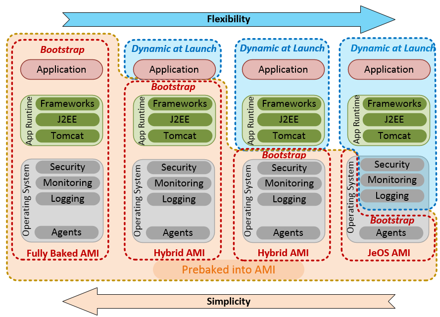
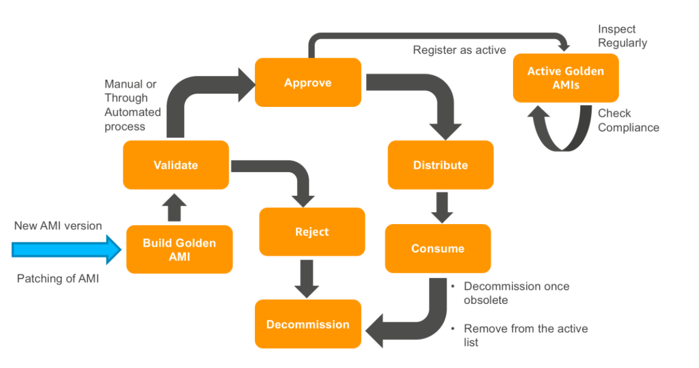
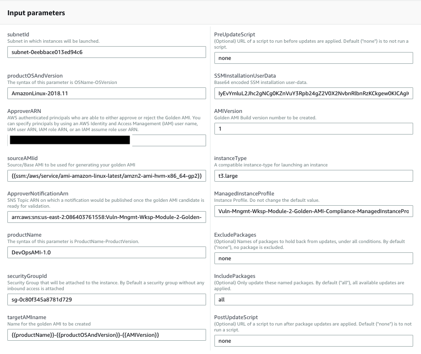
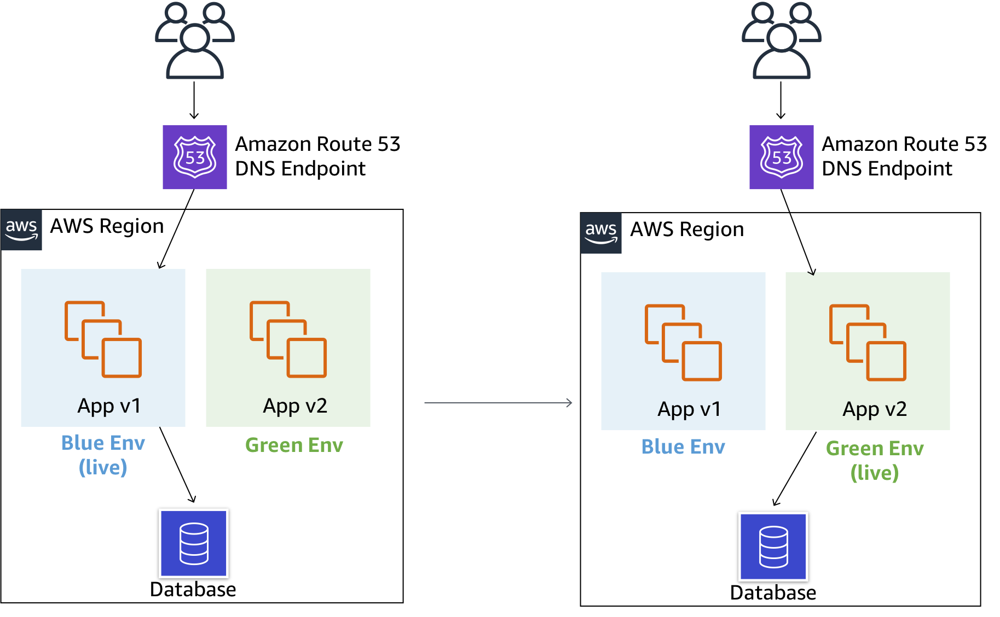
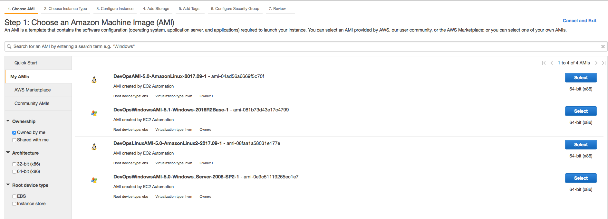

AMI Factory
===========

In a typical enterprise scenario, a cloud team is responsible
for providing the core infrastructure services to development teams, which includes creation of approved AMIs with the latest OS updates, hardening requirements, and required third-party software agents.

## AMI Catalog Decisions

AMI design options differ based on the trade-offs of deployment simplicity versus deployment flexibility. The simplest AMIs are fully baked and purpose-built to deploy a complete running instance, including the installation and configuration of all required software. However, this approach limits flexibility, as a fully baked AMI can only be used to deploy a single instance or a farm of identical instances. The most flexible AMIs include only minimal configurations and software, requiring application specific packages to be installed on first boot. This approach trades simplicity for flexibility as each instance must be properly bootstrapped before it can function as intended.

The ideal AMI design depends largely on the constraints of the workload. When considering which option is right for your organization, keep the following questions in mind:

* How quickly do you need to be able to replace a failing instance or add additional compute capacity?
* Is the workload spikey or static?
* Does your server configuration require manual provisioning or configuration?
* Do you need to minimize the complexity of deploying resources to both AWS and on-premises environments?
* Are there existing server provisioning tools or processes that you are trying to align with AWS?

In this exercise, we will build out the scripts needed to configure the AMI as CIS level 1 compliant, validate that the AMI is actually CIS compliant with Amazon Inspector and look for vulnerabilities from the CVE database. We are going with the JeOS (just enough Operating System) option for AMI design.

## AMI Pipeline

Here's a high-level workflow diagram of the golden AMI pipeline:

Here's what our AMI pipeline solution looks like that we will be deploying today:

## Deploying an AMI Pipeline on AWS
You can use an AWS Systems Manager (SSM) document to configure the AMI according to your organisation's security standards such as CIS, NIST, etc. An AWS Systems Manager document (SSM document) defines the actions that Systems Manager performs on your managed instances. Systems Manager includes more than a dozen pre-configured documents that you can use by specifying parameters at runtime. Documents use JSON or YAML, and they include steps and parameters that you specify.

### Set up the golden AMI pipeline environment

??? info "Click here if you're running this individually in your own AWS Account"
    Launch the CloudFormation stack below to setup the Golden AMI Pipeline Solution:

    Region| Deploy
    ------|-----
    US East 2 (Ohio) | 

    1. Click the **Deploy to AWS** button above (right click and open in a new tab).  This will automatically take you to the console to run the template.  

    2. Click **Next** on the **Specify Template** section.

    3. On the **Specify Details** step enter a **valid** Email Address and your Role/User.

    4. On the **Specify Details** step, fill in the parameters based on the table below and then click **Next**.

    5. Click **Next** on the **Options** section.
    6. Finally, acknowledge that the template will create IAM roles under **Capabilities** and click **Create**.

    This will bring you back to the CloudFormation console. You can refresh the page to see the stack starting to create. Before moving on, make sure the stack is in a **CREATE_COMPLETE**.

!!! warning "Values are case-sensitive"

| Parameter | Default Value | Description |
| ------------ | ------------- | ------------ |
**ApproverARN** | **[REQUIRED]** | AWS authenticated principals who are able to either approve or reject the Golden AMI. You can specify principals by using an AWS Identity and Access Management (IAM) user name, IAM user ARN, IAM role ARN, or an IAM assume role user ARN.
**EmailID** | **[REQUIRED]** | This is the Email ID of the administrator responsible for validating the continuous assessment results
buildVersion | 1 | This is a default version that corresponds to your product. You will override this value when you trigger golden AMI creation/distribution/ decommissioning automation workflow
continuousInspection Frequency | rate (1 day) | This is the frequency at which vulnerability assessment of your active AMIs would take place
instanceType | t2.large | This is the InstanceType that is compatible with all your golden AMIs
productName | DevOpsAMI-1.0 | This is the name of the golden AMI product along with major/minor version number. The syntax of this parameter is ProductName-ProductVersion
productOSAndVersion | AmazonLinux-2018.11 | The syntax of this parameter is OSName-OSVersion. This is the default OS and version number of the OS

You will see following parameters in the output. Note the value of the parameters.

| Parameter | Description |
| ------------ | ------------ |
GoldenAMIAutomationDoc | The name of the SSM automation document you can execute for generating a golden AMI
DecommissionAMIVersionDoc | The name of the SSM automation document you can execute for decommissioning a golden AMI
ContinuousInspectionScheduledRule | The CloudWatch Events rule that executes continuous vulnerability assessment at the frequency you specified
BucketName | The name of the Amazon S3 bucket in which you need to upload CloudFormation Template for launching your golden AMI
ContinuousAssessmentResultsTopic | The SNS topic on which continuous assessment results will be published

### Create a golden AMI

1. Navigate to **Systems Manager** console
2. In the navigation panel, choose **Automation** under **Actions & Change** drop-down.
3. Choose **Execute Automation**.

4. Filter the automations by clicking the **Owned by me** tab. Make sure you are in the Ohio region.

5. Choose the *GoldenAMIAutomationDoc* document name that you noted in the output tab of CloudFormation stack and click Next.
6. Choose following values:
	* Select **Simple Execution**
	
	* Most input parameters will be pre-populated except the sourceAMIid and AMIVersion. We will be querying for the latest AMI IDs using AWS Systems Manager Parameter Store. You can see we have used the Amazon Linux Public AMI Parameter.
	
	You can find more information on querying for the latest AMI IDs at the following links
	* <a href="https://aws.amazon.com/blogs/compute/query-for-the-latest-amazon-linux-ami-ids-using-aws-systems-manager-parameter-store/" target="_blank">Query for the latest Amazon Linux AMI IDs using AWS Systems Manager Parameter Store</a>
	* <a href="https://aws.amazon.com/blogs/mt/query-for-the-latest-windows-ami-using-systems-manager-parameter-store/" target="_blank">Query for the Latest Windows AMI Using Systems Manager Parameter Store</a>
	* We do the same with a Windows 2016 Base AMI by following the same steps again.
	

7. You can leave remaining parameters as it is. Automation document launches instances in a private subnet, with a security group that has no inbound access for launching instances.
8. Next, click on **Execute**.

!!! info
	The process may take approximately 30 minutes to 1.5 hours depending upon the available number of updates and scripts executed on the AMI. You can either schedule it to run periodically OR trigger it manually OR trigger it at the end of your CI-CD pipeline.

!!! tip
	For this lab we recommend using a Amazon Linux 2 AMI. You may choose a Windows AMI as well but in the interest of time, you can move on to the next section of the lab while the automation is working in the background.

Here is how the process works:

1. The process takes a source AMI, creates an instance, updates packages, and executes your custom code for hardening the instance and installing required agents.
2. Next, it stops the instance and creates an image from the stopped instance.
3. Since the security posture of an AMI can be assessed based on the security posture of an instance, automation creates an EC2 instance from the newly created golden AMI.
4. It then installs an Amazon Inspector agent on the EC2 instance and triggers an Amazon Inspector assessment. The Amazon Inspector assessment setup evaluates following rules packages:
	* <a href="https://docs.aws.amazon.com/inspector/latest/userguide/inspector_cves.html" target="_blank">Common Vulnerabilities and Exposures (CVEs)</a>
	* <a href="https://docs.aws.amazon.com/inspector/latest/userguide/inspector_cis.html" target="_blank">Center for Internet Security (CIS) Benchmarks</a>
	* <a href="https://docs.aws.amazon.com/inspector/latest/userguide/inspector_security-best-practices.html" target="_blank">AWS Security Best Practices</a>
	* <a href="https://docs.aws.amazon.com/inspector/latest/userguide/inspector_runtime-behavior-analysis.html" target="_blank">Runtime Behavior Analysis</a>
5. Once the assessment is complete, Amazon Inspector records findings and publishes an SNS notification.
6. Since your email-ID was subscribed to the SNS topic, you will receive a notification email containing information like shown below.

### Review assessment result

1. Navigate to Systems Manager service.
2. Ensure that you are in the correct region (US-East-2).
3. In the navigation panel, choose **Parameter Store** under **Application Management** drop-down.
4. Filter parameters by using a *Name : begins-with* filter and enter the path specified in the notification.

5. Choose the result.
6. Review the Value. The following value suggests that there were security findings found in the AMI.

7. To review findings, open the Inspector service console.
8. The dashboard will display recent assessment runs. Choose the assessment run corresponding to your golden AMI.

9. You can either choose Download report to see details of the finding or you can review the information by choosing the number under the Findings column.

Based on what you see, you can choose to Approve or Deny the AMI. If you approved the golden AMI, you will see a new private golden AMI registered under your AMIs in the Amazon EC2 console.

Every time you create a new version of the golden AMI, ensure that you have specified a consistent product-name as well as the operating system.

We suggest that customers trigger this automation at least every 30 days. This ensures that they are pulling the latest image with updates and patches applied. We then suggest configuring it to your standards and distributing it to your application teams with a sufficient window to test their applications in a staging environment before going live.

This pattern of “rehydrating” your Production environment with an automated release of an updated full-stack application is called a Blue-Green deployment. At a high level it looks like the image below:

!!! tip "You can read more about these design patterns at the following links"
	* <a href="https://d1.awsstatic.com/whitepapers/AWS_Blue_Green_Deployments.pdf" target="_blank">AWS Blue Green Deployments White Paper</a>
	* <a href="https://aws.amazon.com/blogs/devops/bluegreen-infrastructure-application-deployment-blog/" target="_blank">Automating Blue/Green Deployments of Infrastructure and Application Code using AMIs, AWS Developer Tools, & Amazon EC2 Systems Manager]</a>

## Takeaway

You have now deployed an AMI baking pipeline that uses AWS Systems Manager (SSM) to configure the base AMI according to your security requirements and assessed it for vulnerabilities.

If you approved your AMI, navigate to the EC2 Console:

1. Click Launch Instances
2. Click on My AMIs

3. Select the AMI created by the automation process and launch without a key pair.
