Vulnerability Assessment and Patch Manager Setup
===============================================

In this section we are going to detect vulnerabilities on our live instances with <a href="https://aws.amazon.com/inspector/" target="_blank">Amazon Inspector</a>. Due to the duration of a comprehensive vulnerability assessment and the limitation of time for the workshop we will test for Security Group vulnerabilities with the new Amazon Inspector Network Reachability rules package.

Additionally, we will also show how to handle the execution of system patches utilizing approval workflows known as Patch Baselines.

## Setting up and Running Amazon Inspector

!!! tip
	You can use the SSM run command to install the agent on your EC2 instances if they do not have the agent installed. <a href="https://docs.aws.amazon.com/inspector/latest/userguide/inspector_installing-uninstalling-agents.html#install-run-command" target="_blank">Here</a> is how you can do it.

1. From the Management Console, go to the <a href="https://us-east-2.console.aws.amazon.com/inspector/home?region=us-east-2#/dashboard" target="_blank">Amazon Inspector</a> page. Click the Help Me Create an Assessment.

2. Click Advanced Setup

3. Create the assessment target
	
	* Use **Owner** as the Key.
	* Include your IAM user name. You can find this as one of the values assigned to your instances by looking through the tags associated with your instances.
	
	
	* As you can see, using tags enables you to perform an assessment across operating system types, so from an assessment standpoint, you don’t need to worry about managing different OS’s separately, although you could if you wanted to.

4. Create assessment template
	
	* Use the target previously defined.
	* Select only the Network Reachability package.
	* Select 15 minute duration.
	* Set Assessment Schedule to 1 Days
	
	
	* Click Next
	* On the next screen hit Create
	* You can now see your assessment template and configure it with an SNS topic for notifications and to trigger automated actions such as alerting and patching.
	
	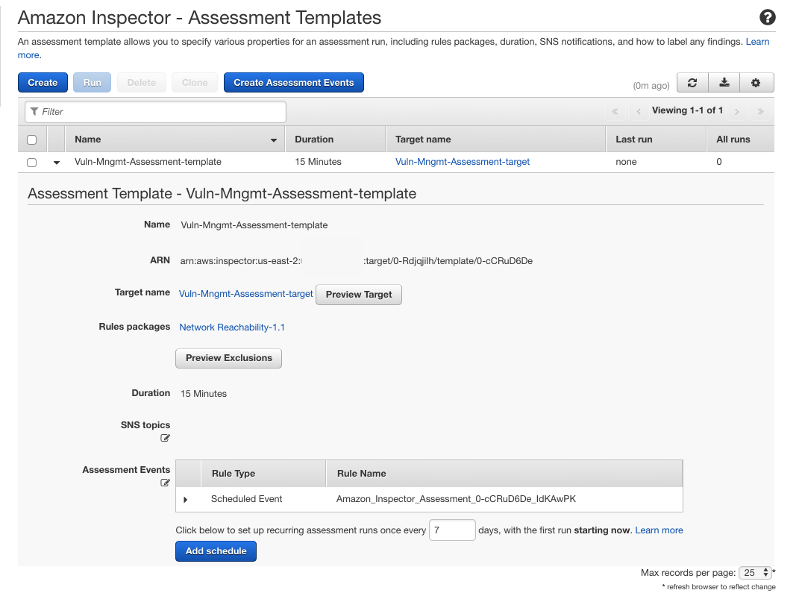

5. Select your template and click Run

6. Click on Findings in the Navigation Pane. Select one of the Medium Severity findings. You can find details as seen below in terms of Network Reachability


## Patching your Windows and Linux instances with AWS SSM Patch Manager

AWS Systems Manager Patch Manager automates the process of patching managed instances with security-related updates. For Linux-based instances, you can also install patches for non-security updates. You can patch fleets of Amazon EC2 instances or your on-premises servers and virtual machines (VMs) by operating system type. This includes supported versions of Windows, Ubuntu Server, Red Hat Enterprise Linux (RHEL), SUSE Linux Enterprise Server (SLES), Amazon Linux, and Amazon Linux 2. You can scan instances to see only a report of missing patches, or you can scan and automatically install all missing patches.

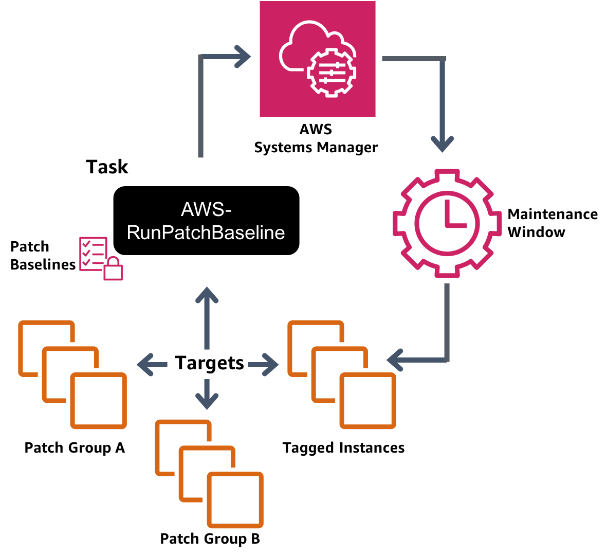

Patch Manager uses patch baselines, which include rules for auto-approving patches within days of their release, as well as a list of approved and rejected patches. You can install patches on a regular basis by scheduling patching to run as a Systems Manager Maintenance Window task. You can also install patches individually or to large groups of instances by using Amazon EC2 tags.

## Creating EC2 instance Role for SSM and tagging under a Patch Group

### Create an IAM role for Systems Manager

Before launching an Amazon EC2 instance, we recommend that your EC2 instances are associated with an instance profile with the **AmazonEC2RoleforSSM** AWS Managed Policy attached.

1. Sign in to the IAM console and choose Roles in the navigation pane. Choose Create new role.
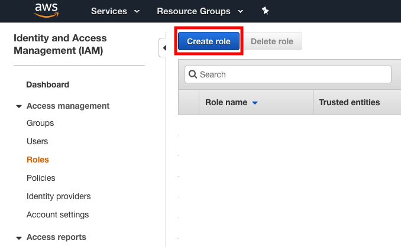

2. In the role-creation workflow, choose AWS service > EC2 > EC2 to create a role for an EC2 instance.
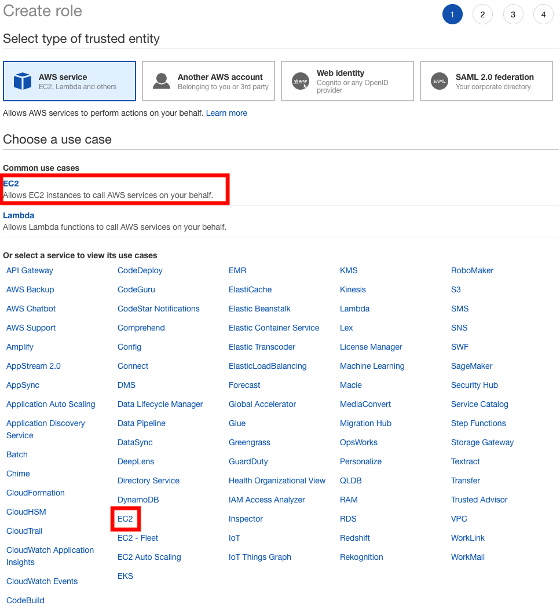

3. Choose the AmazonEC2RoleforSSM policy to attach it to the new role you are creating.


4. Give the role a meaningful name (I chose EC2SSM) and description, and choose Create role.
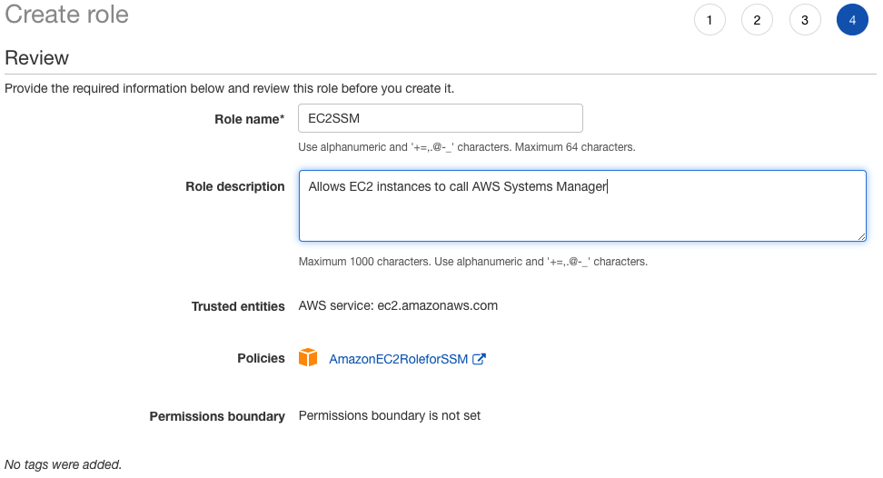


### Attach role to EC2 Instances

1. Navigate the EC2 console and select one of your instances from Module 1.
2. Select that instance and then click on the **Actions** drop down
3. Select **Instance Settings** and then Attach/Replace IAM Role
4. Select the IAM Role that you just created and hit **Apply**

### Add Tags

The final step of configuring your EC2 instances is to add tags. You will use these tags to configure Systems Manager later in this module. For this example, I add a tag key, Patch Group, and set the value to Windows Servers. I could have other groups of EC2 instances that I treat differently by having the same tag key but a different tag value. For example, I might have a collection of other servers with the Patch Group tag key with a value of IIS Servers.


## Configure AWS Systems Manager

In this section, I show you how to use Systems Manager to apply operating system patches to your EC2 instances, and how to manage patch compliance.

To start, I will provide some background information about Systems Manager. Then, I will cover how to:

* Create the Systems Manager IAM role so that Systems Manager is able to perform patch operations.
* Associate a Systems Manager patch baseline with your instance to define which patches Systems Manager should apply.
* Define a maintenance window to make sure Systems Manager patches your instance when you tell it to.
* Monitor patch compliance to verify the patch state of your instances.

Systems Manager is a collection of capabilities that helps you automate management tasks for AWS-hosted instances on EC2 and your on-premises servers. In this section, we use Systems Manager for two purposes: to run remote commands and apply operating system patches.

Patches for these new vulnerabilities are available through Systems Manager within hours after Microsoft releases them. There are two prerequisites to use Systems Manager to apply operating system patches. First, you must attach the IAM role you created in the previous section, EC2SSM, to your EC2 instance. Second, you must install the Systems Manager agent on your EC2 instance. If you have used a recent Microsoft Windows Server 2012 R2 AMI published by AWS, Amazon has already installed the Systems Manager agent on your EC2 instance.

To make sure your EC2 instance receives operating system patches from Systems Manager, you will use the default patch baseline provided and maintained by AWS, and you will define a maintenance window so that you control when your EC2 instances should receive patches. For the maintenance window to be able to run any tasks, you also must create a new role for Systems Manager. This role is a different kind of role than the one you created earlier: Systems Manager will use this role instead of EC2. Earlier we created the *EC2SSM* role with the *AmazonEC2RoleforSSM* policy, which allowed the Systems Manager agent on our instance to communicate with the Systems Manager service. Here we need a new role with the policy *AmazonSSMMaintenanceWindowRole* to make sure the Systems Manager service is able to execute commands on our instance.

### Create the Systems Manager IAM Role

To create the new IAM role for Systems Manager, follow the same procedure as in the previous section, but in Step 3, choose the **AmazonSSMMaintenanceWindowRole** policy instead of the previously selected **AmazonEC2RoleforSSM** policy.


Finish the wizard and give your new role a recognizable name. For example, I named my role MaintenanceWindowRole

By default, only EC2 instances can assume this new role. You must update the trust policy to enable Systems Manager to assume this role.

To update the trust policy associated with this new role:

1. Navigate to the IAM console and choose **Roles** in the navigation pane.

2. Choose **MaintenanceWindowRole** and choose the **Trust relationships** tab. Then choose **Edit trust relationship**.
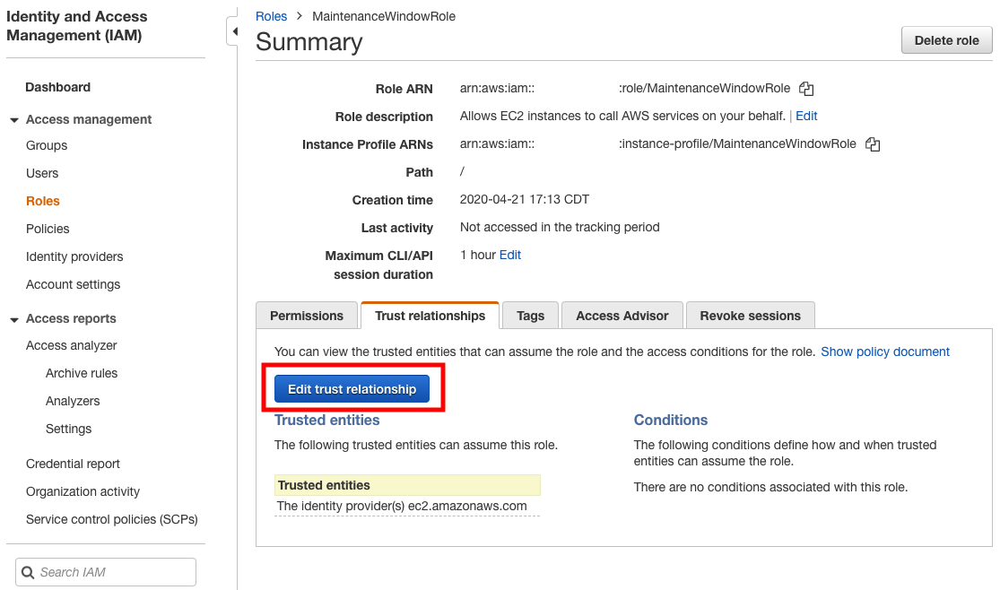

3. Update the policy document by copying the following policy and pasting it in the Policy Document box. As you can see, I have added the <a href="https://aws.amazon.com/ssm/" target="_blank">SSM</a> service to the list of allowed Principals that can assume this role. Choose Update Trust Policy.

```
{
   "Version":"2012-10-17",
   "Statement":[
      {
         "Sid":"",
         "Effect":"Allow",
         "Principal":{
            "Service":[
               "ec2.amazonaws.com",
               "ssm.amazonaws.com"
           ]
         },
         "Action":"sts:AssumeRole"
      }
   ]
}
```

### Associate a Systems Manager patch baseline with your instance

Next, you are going to associate a Systems Manager patch baseline with your EC2 instance. A patch baseline defines which patches Systems Manager should apply. You will use the default patch baseline that AWS manages and maintains. Before you can associate the patch baseline with your instance, though, you must determine if Systems Manager recognizes your EC2 instance.

Navigate to the Systems Manager console, select **Managed Instances** under the **Instances & Nodes** dropdown. Your new EC2 instance should be available there
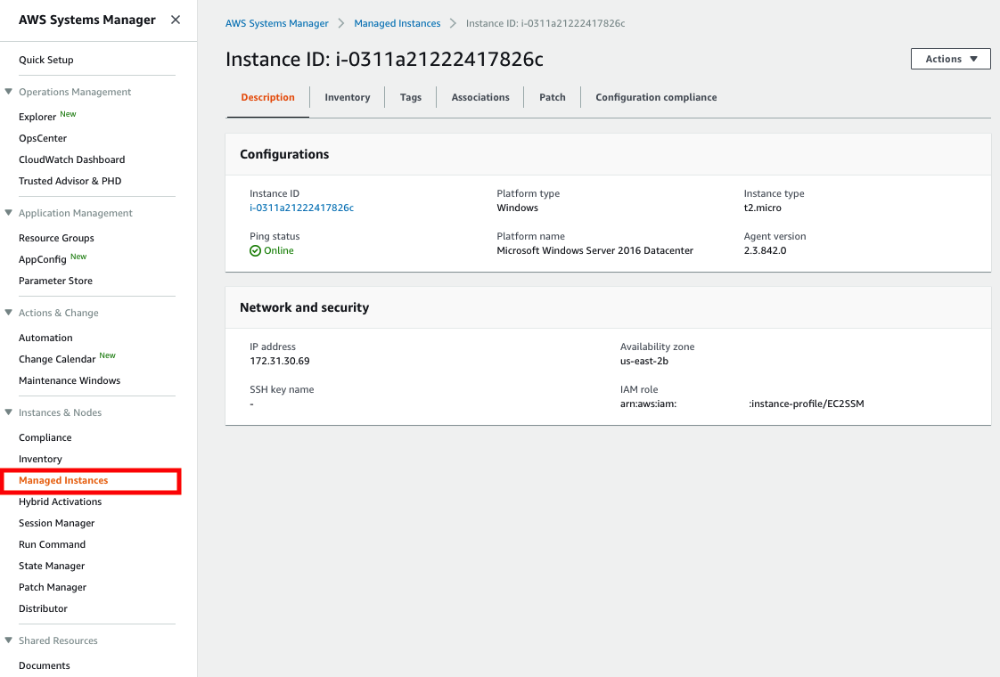

Now that you have confirmed that Systems Manager can manage your EC2 instance, it is time to associate the AWS maintained patch baseline with your EC2 instance:

1. Choose **Patch Manager** under **Instances & Nodes** in the sidebar of the AWS Systems Manager Console.

2. Choose **View predefined patch baselines** as highlighted in the following screenshot, and choose **Modify Patch Groups** in the **Actions** drop-down.
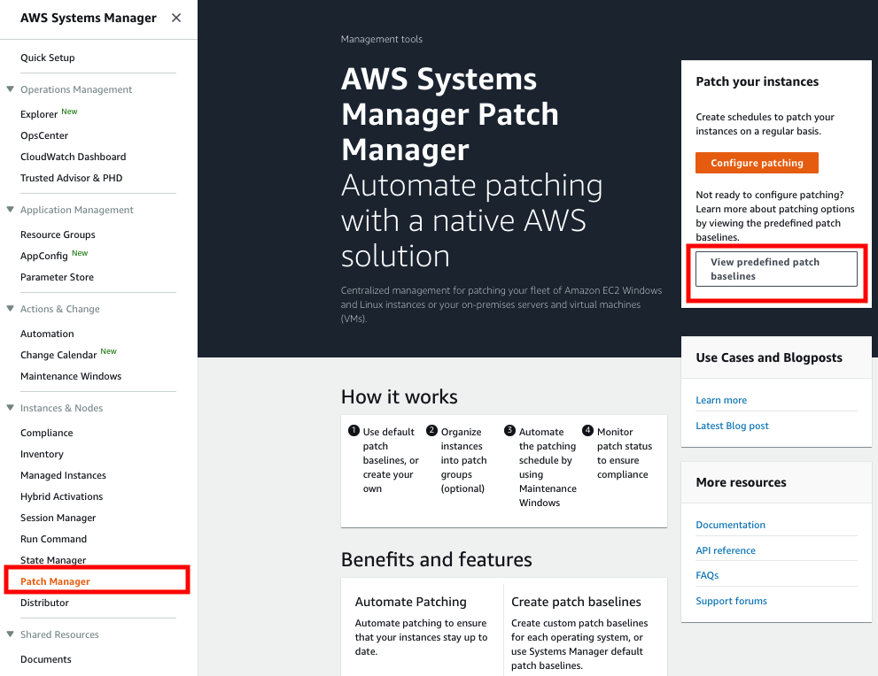

3. In the Patch group box, enter the same value you entered under the Patch Group tag of your EC2 instance. In this example, the value I enter is Windows Server. Click the **Add** button next to the patch group and click **Close**.
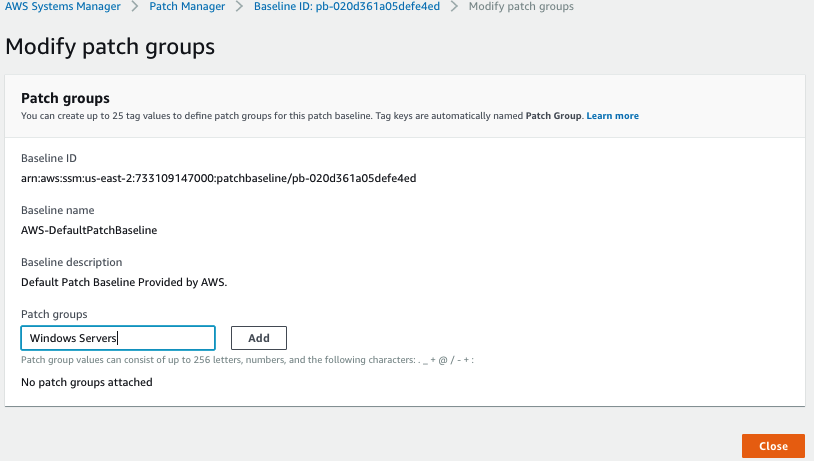

### Define a Maintenance Window

Now that you have successfully set up a role and have associated a patch baseline with your EC2 instance, you will define a maintenance window so that you can control when your EC2 instances should receive patches. By creating multiple maintenance windows and assigning them to different patch groups, you can make sure your EC2 instances do not all reboot at the same time. The *Patch Group* resource tag you defined earlier will determine to which patch group an instance belongs.

1. Navigate to the Systems Manager console, in the sidebar under **Actions & Change** choose **Maintenance Windows**. Choose Create a Maintenance Window.
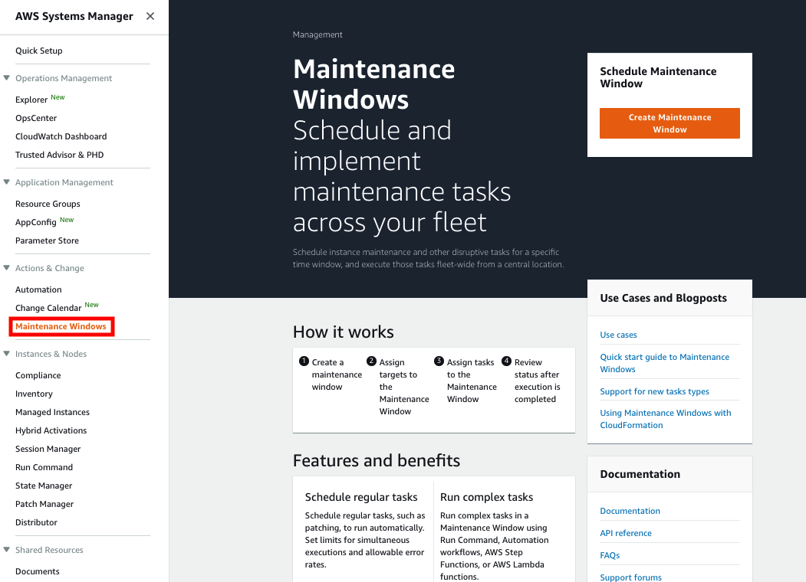

2. Select the Cron schedule builder to define the schedule for the maintenance window. In the example in the following screenshot, the maintenance window will start every Saturday at 10:00 P.M. UTC.

3. To specify when your maintenance window will end, specify the duration. In this example, the four-hour maintenance window will end on the following Sunday morning at 2:00 A.M. UTC (in other words, four hours after it started).

4. Systems manager completes all tasks that are in process, even if the maintenance window ends. In my example, I am choosing to prevent new tasks from starting within one hour of the end of my maintenance window because I estimated my patch operations might take longer than one hour to complete. Confirm the creation of the maintenance window by choosing **Create maintenance** button.
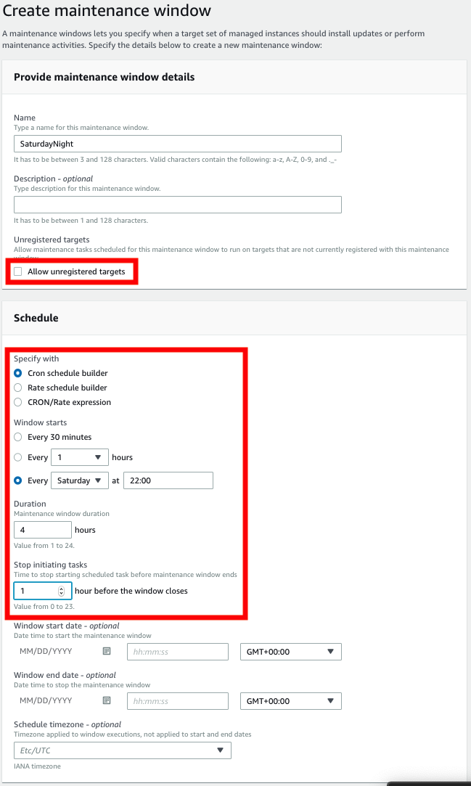

5. After creating the maintenance window, you must register the EC2 instance to the maintenance window so that Systems Manager knows which EC2 instance it should patch in this maintenance window. To do so, choose **Register targets** by selecting the option under **Actions** after you select your new maintenance window. You can register your targets by using the same Patch Group tag you used before to associate the EC2 instance with the AWS-provided patch baseline.
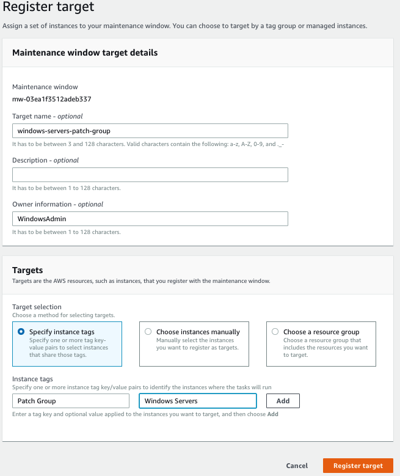

6. Assign a task to the maintenance window that will install the operating system patches on your EC2 instance:

	* Open **Maintenance Windows** in the Systems Manager console, select your previously created maintenance window and choose **Register run command** task from the **Actions** drop-down.
	* For **Maintenance window task details**:
		* Give the Maintenance Window an optional Name and Description
	* For **Comand document**:
		* Search for the *AWS-RunPatchBaseline* document from the list of available documents.
	* For **Targets**:
		* Select your previously created *Window Target ID*
	* For **Rate control**:
		* Specify your Concurrency and Error threshold
		 
		!!! info
			If you have a large number of EC2 instances and want to patch all EC2 instances within the defined time, make sure this number is not too low. For example, if you have 1,000 EC2 instances, a maintenance window of 4 hours, and 2 hours’ time for patching, make this number at least 500.
	
	* For **IAM service role**
		* Choose the role you created previously (called *MaintenanceWindowRole*).
	* Leave **Output options** and **SNS notifications** unchecked
	* For **Parameters**:
		* For **Operation**, choose Install to make sure to install the patches.
		* Leave the rest of the Parameters to default or no values
		
Now, you must wait for the maintenance window to run at least once according to the schedule you defined earlier. Note that if you don’t want to wait, you can adjust the schedule to run sooner by choosing Edit maintenance window on the Maintenance Windows page of Systems Manager. If your maintenance window has expired, you can check the status of any maintenance tasks Systems Manager has performed on the Maintenance Windows page of Systems Manager and select your maintenance window.

### Monitor Patch Compliance

You also can see the overall patch compliance of all EC2 instances that are part of defined patch groups by choosing **Compliance** under the **Instances & Nodes** tab in the Systems Manager Console. You can filter by Patch Group to see how many EC2 instances within the selected patch group are up to date, how many EC2 instances are missing updates, and how many EC2 instances are in an error state.
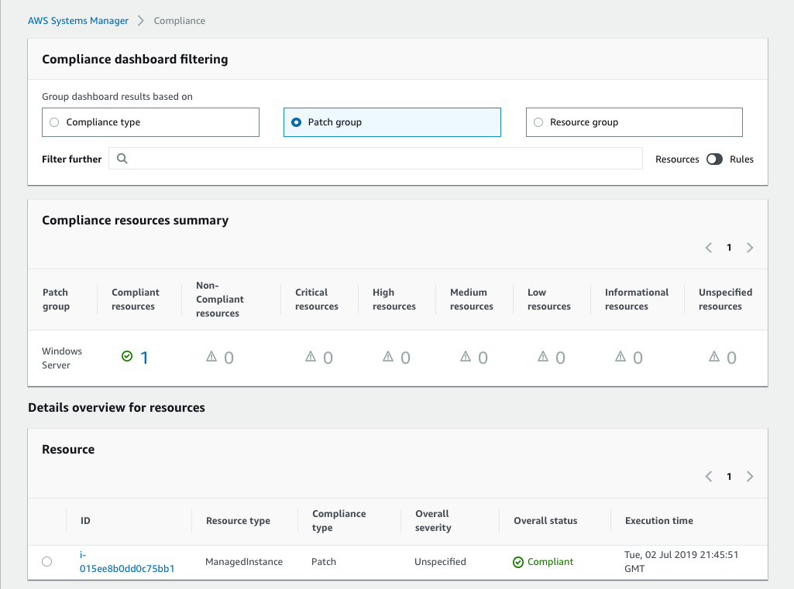

!!! Info
	If you check the Compliance tab in the Systems Manager console during this lab you may not see any results due to the Task in your Maintenance Window not running yet.

### Takeaway

In this section, you have set everything up for patch management on your instance. Now you know how to patch your EC2 instance in a controlled manner and how to check if your EC2 instance is compliant with the patch baseline you have defined. Of course, I recommend that you apply these steps to all EC2 instances you manage.

## Automation - Patching your Windows and Linux instances with AWS SSM Patch manager

AWS SSM Patch Manager enables automation of the process of patching managed instances. Instances can be scanned to see a report of missing patches, or automatically install all missing patches. Patch Manager uses patch baselines that include rules for auto-approving patches within days of their release, as well as a list of approved and rejected patches.

Patches can be installed on a regular basis by scheduling patching to run as a Systems Manager Maintenance Window task. Patches can be at any scale from individual instances to large groups of instances by using Amazon EC2 tags.

To use Patch Manager, the following tasks must be completed.

1. Verify that the default patch baselines meet your needs, or create patch baselines that define a standard set of patches for your instances.
2. Organize instances into patch groups by using Amazon EC2 tags.
3. Schedule patching by using a Maintenance Window that defines which instances to patch and when to patch them.
4. Monitor patching to verify compliance and investigate failures.

### Patch Anatomy

The Patch Anatomy automation can be seen below:

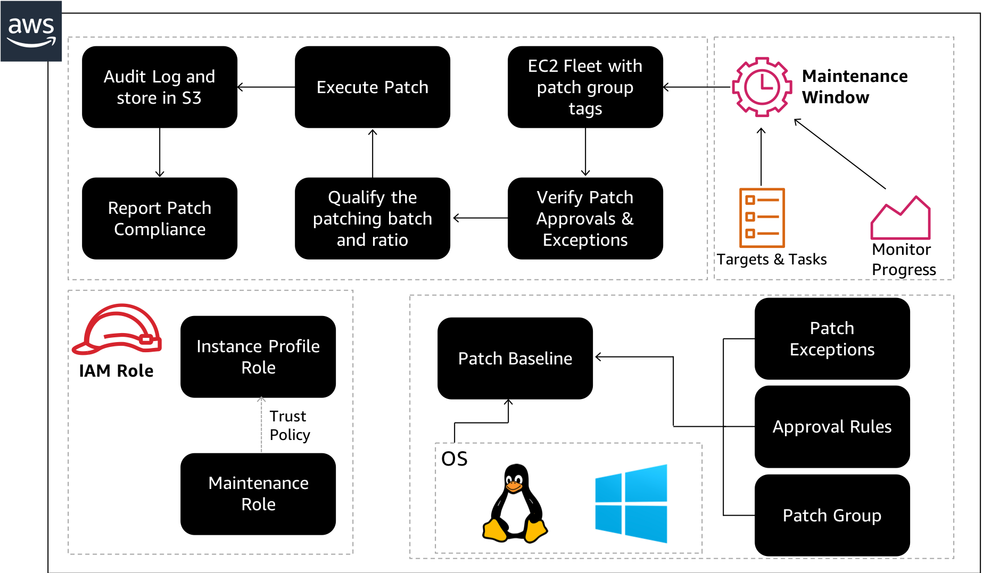

Select the patches you want to deploy and control timing for patch roll-outs and instance reboots. Define auto-approval rules for patches and have the ability to black-list or white-list specific patches. Schedule the automatic roll out through maintenance windows

### Patch Workflow

We will deploy a CloudFormation that will create the following Patch management Workflow

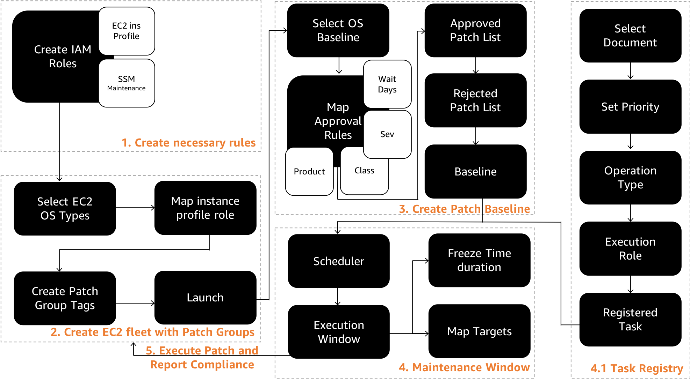

1. Create necessary roles

	* The roles to enable the EC2 instance communicate with SSM and SSM to communicate with the EC2 instance to be created.
	
2. Create EC2 fleet with Patch Groups

	* Create EC2 instances with the instance profile created above and attach the ‘Patch Group’ tag to the associated instances.
	
3. Create patch baseline

	* A patch baseline defines which patches are approved for installation on your instances. You can specify approved or rejected patches one by one.
	* Auto-approval rules specify that certain types of updates (for example, critical updates) should be automatically approved. The rejected list overrides both the rules and the approve list.
4. Create patch groups

	* Patch groups can be defined by the type of operating system, compliance level and classification of the patch.
	
5. Create a maintenance window

	* This is the scheduler that maps through the list of registered targets and the corresponding tasks to be executed.
	* The task registry has the document to be executed and the priority where multiple tasks are involved and attach the execution role created earlier.

### Deploy CloudFormation

??? info "Click here if you're running this individually in your own AWS Account"
    Launch the CloudFormation stack below to setup the SSM Patch Management Script:

    Region| Deploy
    ------|-----
    US East 2 (Ohio) | <a href="https://console.aws.amazon.com/cloudformation/home?region=us-east-2#/stacks/new?stackName=Vuln-Mngmt-Wksp-Module-3-SSM-Patch-Management&templateURL=https://sec337-reinvent.s3.us-east-2.amazonaws.com/Templates/SSM-Automation-Setup.template" target="_blank"></a>

    1. Click the **Deploy to AWS** button above (right click and open in a new tab).  This will automatically take you to the console to run the template.  

    2. Click **Next** on the **Specify Template** section.

    3. On the **Specify Details** step click **Next**. 

    4. Click **Next** on the **Options** section.
    
    5. Finally, acknowledge that the template will create IAM roles under **Capabilities** and click **Create**.

    This will bring you back to the CloudFormation console. You can refresh the page to see the stack starting to create. Before moving on, make sure the stack is in a **CREATE_COMPLETE**.

**Expected Outcome**

The instances which are scanned and ready to be patched using the Patch Manager will be visible under the EC2 – SSM – Managed Instances.

The compliance report can be fetched with filter by tag values (‘Windows2012-PatchGroup’ for Windows and ‘Amz_Linux_Patch_Group’ for Amazon Linux) or by instance id. The data will display the instances that are compliant and/or instances that need patching. This provides complete audit capability on your environment.
	