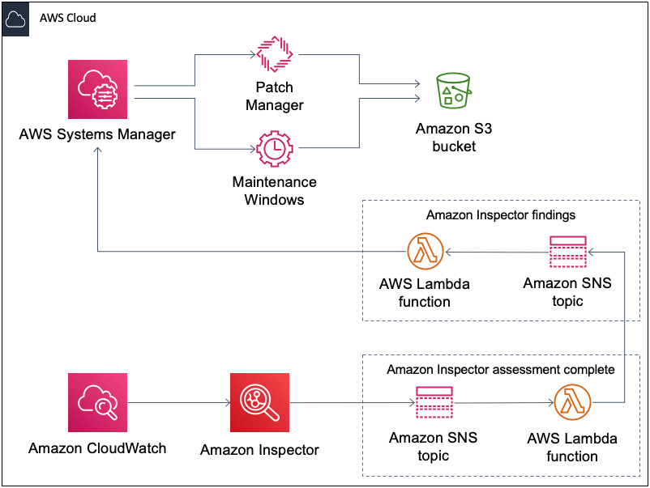
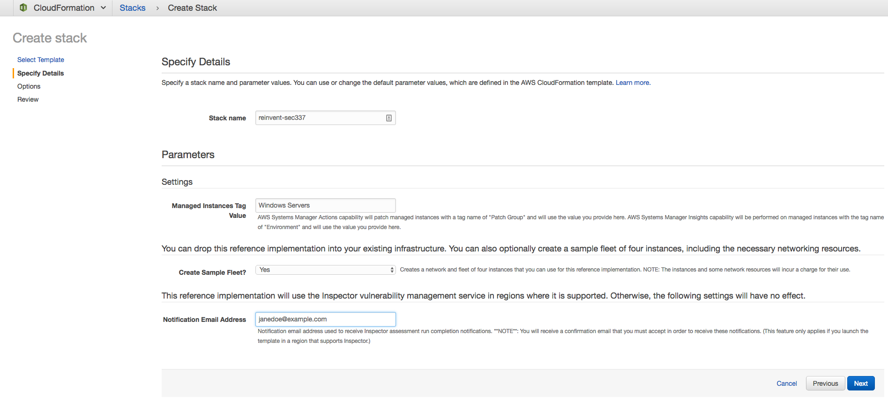
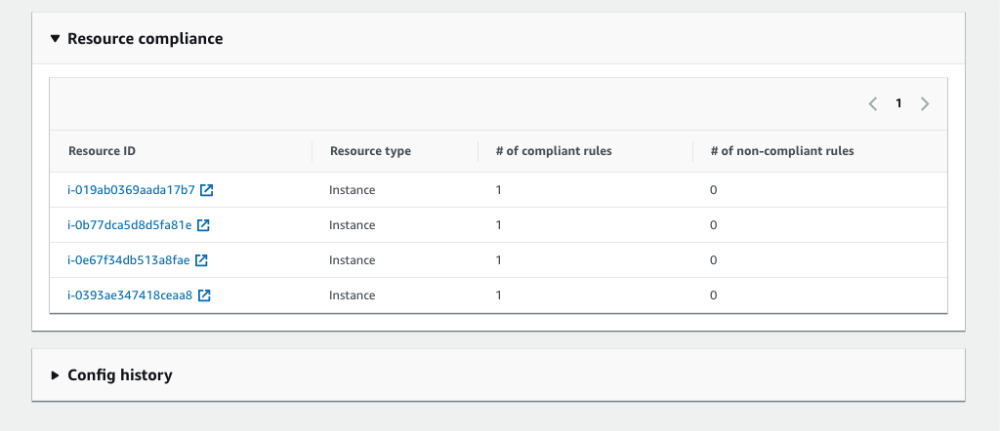

EC2 Fleet Management at Scale
============================
In this module we will put all our knowledge together from the last 3 modules to manage our EC2 Server Fleet at Scale. This implementation guide discusses architectural considerations and configuration steps for deploying the Server Fleet Management at Scale solution on the Amazon Web Services (AWS) Cloud. It includes links to an AWS CloudFormation template that launches, configures, and runs the AWS services required to deploy this solution using AWS best practices for security and availability.

# Overview

Amazon Web Services (AWS) customers who own a fleet of servers are sometimes unsure of how to best automate their fleet management for operational efficiency and maintenance. AWS Systems Manager provides a unified user interface so customers can view operational data from multiple AWS services, and allows customers to automate operational tasks across their AWS resources. With Systems Manager, customers can maintain a consistent configuration of their Amazon Elastic Compute Cloud (Amazon EC2) or on-premises instances. They can also automate maintenance and deployment tasks, or automatically apply patches, updates, and configuration changes across any resource group.

To help customers more easily leverage the capabilities of Systems Manager, AWS offers the Server Fleet Management at Scale solution. This solution combines Systems Manager with Amazon Inspector, an automated security assessment service, to help simplify software inventory management, OS patch compliance, and security vulnerability assessments on managed instances. The solution is easy-to-deploy, and automatically provisions the services necessary to automate server fleet management.

**Cost**

You are responsible for the cost of the AWS services used while running this reference deployment. As of the date of publication, the cost for running this solution with default settings in the US East (N. Virginia) Region for 100 Amazon EC2 instances, and daily Amazon Inspector assessments is approximately $562.50 per month. This pricing does not include variable charges incurred from Amazon EC2 instances, Amazon Simple Storage Service (Amazon S3), AWS Lambda, or Amazon CloudWatch.

Prices are subject to change. For full details, see the pricing webpage for each AWS service you will be using in this solution.

# Architecture

The AWS CloudFormation template deploys AWS Systems Manager, Amazon Inspector, an Amazon Simple Storage Service (Amazon S3) bucket, an AWS Key Management Service (AWS KMS) key, an AWS Identity and Access Management (IAM) role, an Amazon CloudWatch event, an AWS Lambda function, and an Amazon Simple Notification Service (Amazon SNS) topic.

Systems Manager specifies patch compliance thresholds, defines the schedule for when patching tasks should be run, and defines the Systems Manager associations used to periodically ensure that servers remain in compliance with established configurations. Systems Manager artifacts, including patching and server execution histories and inventories, are stored in the Amazon SNS bucket and encrypted with an AWS KMS key.

A CloudWatch event triggers Amazon Inspector to run daily security assessments on your fleet of Amazon Elastic Compute Cloud (Amazon EC2) instances. Amazon Inspector defines the rules packages for assessments and identifies the target Amazon EC2 instances for assessment runs. When the assessment is complete, Amazon Inspector publishes a message to an Amazon SNS topic that has two subscribers; an AWS Lambda function, and the provided email address. The function then queries Amazon Inspector for the agent IDs of the agents within the assessment run, and sends a message for each agent ID to a second Amazon SNS topic. A second Lambda function receives a notification for each agent ID and queries Amazon Inspector for the findings for each agent, sorts them by vulnerabilities, and updates the Systems Manager Inventory data for the instance under management. Note that the maximum number of agents that can be included in the assessment target of an assessment run is 500.

# Prerequisites

1. Terminate Instances created in earlier modules
2. Delete the SSM Patch Management CloudFormation stack from Module 3

# Solution Components

## Systems Manager Associations

The ManageInspectorAgent association runs weekly to ensure that the Inspector agent is installed on the targeted managed instances.

The GatherSoftwareInventory association runs daily to gather the software inventory of the targeted managed instances. You can view a list of the managed instance’s application in the Managed Instance Console Inventory tab.

## Maintenance Window

A maintenance window allows you to define tasks that will be run against a set of instances on a given schedule. This gives you flexibility and control for how you perform routine tasks. The solution’s created maintenance window is scheduled to run weekly in a two-hour window, contains a Run Command task that uses the document AWS-RunPatchBaseline to perform patching, and updates the targets defined by the Patch Group tag key and the Environment value supplied in the Managed Instances Tag Value parameter.

## Amazon Inspector Rules Packages

Amazon Inspector compares the behavior and the security configuration of the assessment targets to selected security rules packages. Currently, this solution uses the following rules packages:

* Common Vulnerabilities and Exposures
* Security Best Practices
* Runtime Behavior Analysis

# Launch the Template

This solution uses AWS CloudFormation to automate the deployment of the Server Fleet Management at Scale solution. It includes the following AWS CloudFormation template, which you can download before deployment

[Server Management at Scale CFN Template](./Templates/server-fleet-management-at-scale.template)

Use this template to launch the solution and all associated components. The default configuration deploys AWS Systems Manager, Amazon Inspector, an Amazon Simple Storage Service (Amazon S3) bucket, an AWS Key Management Service (AWS KMS) key, an AWS Identity and Access Management (IAM) role, an Amazon CloudWatch event, an AWS Lambda function, and an Amazon Simple Notification Service (Amazon SNS) topic, but you can also customize the template based on your specific needs.

**Note**

If you delete the solution stack, all of the resources created by the AWS CloudFormation template will be deleted, except the Resource Sync Amazon S3 bucket. You must manually delete the bucket.

## Steps

1. Navigate to the AWS CloudFormation console

2. Click Create New Stack and enter the S3 URL to the CloudFormation template or you can upload the template if you downloaded it earlier

3. Give the stack a name, enter the Tag Value of your Patch Group. In module 3 we used the value Windows Servers. Select Yes on Create Sample Fleet. Finally enter an email address on which you wish to receive Email Notifications of your Inspector Assessments.

4. Create the Stack. Remember to check the box acknowledging that AWS CloudFormation might create IAM resources with custom names

# Exercises

## AWS SSM Session Manager Walkthrough

As customers on AWS move towards a model of deploying IT resources via Infrastructure-as-code, there is still a need for maintaining legacy applications by the old model of limited automation and manual tasks. IT administrators still need shell-level access to their servers on occasion. They might need to kill runaway processes, consult server logs, fine-tune configurations, or install temporary patches, all while maintaining a strong security profile. They want to avoid the hassle that comes with running Bastion hosts and the risks that arise when opening up inbound SSH ports on the instances.

AWS already addressed some of the need for shell-level access with the AWS Systems Manager Run Command. This AWS facility gives administrators secure access to EC2 instances. It allows them to create command documents and run them on any desired set of EC2 instances, with support for both Linux and Microsoft Windows. The commands are run asynchronously, with output captured for review.

The new Session Manager makes the AWS Systems Manager even more powerful. You can now use a new browser-based interactive shell and a command-line interface (CLI) to manage your Windows and Linux instances. Here’s what you get:

**Secure Access** – You don’t have to manually set up user accounts, passwords, or SSH keys on the instances and you don’t have to open up any inbound ports. Session Manager communicates with the instances via the SSM Agent across an encrypted tunnel that originates on the instance, and does not require a bastion host.

**Access Control** – You use IAM policies and users to control access to your instances, and don’t need to distribute SSH keys. You can limit access to a desired time/maintenance window by using IAM’s Date Condition Operators.

**Auditability** – Commands and responses can be logged to Amazon CloudWatch and to an S3 bucket. You can arrange to receive an SNS notification when a new session is started.

**Interactivity** – Commands are executed synchronously in a full interactive bash (Linux) or PowerShell (Windows) environment

**Programming and Scripting** – In addition to the console access that I will show you in a moment, you can also initiate sessions from the command line (aws ssm ...) or via the Session Manager APIs.

The SSM Agent running on the EC2 instances must be able to connect to Session Manager’s public endpoint. You can also set up a PrivateLink connection to allow instances running in private VPCs (without Internet access or a public IP address) to connect to Session Manager.

**Session Manager in Action**

1. Choose Start session

	In the Target instances list, choose the radio button to the left of the instance you want to connect to. In order to use Session Manager to access your EC2 instances, the instances must be running the latest version (2.3.12 or above) of the SSM Agent. The instance profile for the instances must reference a policy that allows access to the appropriate services; you can create your own or use AmazonEC2RoleForSSM. You have walked through this exercise in Module 3 and the sample fleet deployed in this exercise have been launched with the necessary instance profile.

2. Select the Linux AMI
	
3. The session opens up immediately:
	
4. Similarly, with the Windows instance, you can see a session below:
	

**What is a Session?**

A session is a connection made to an instance using Session Manager. Sessions are based on a secure bi-directional communication channel between the client (you) and the remote managed instance that streams inputs and outputs for commands. Traffic between a client and a managed instance is encrypted using TLS 1.2, and requests to create the connection are signed using Sigv4. This two-way communication enables interactive bash and PowerShell access to instances. When you start a session, AWS SSM Session Manager initiates a connection to a target (for example, an instance) for a Session Manager session. In the background, a WebSocket connection is open for sending input and receiving outputs.

## Analyze your fleet with Insights

**Enable AWS Config Rules**
1. Sign in to the AWS Management Console and open the AWS Config console at https://console.aws.amazon.com/config/

2. In the left navigation, choose Rules.

3. On the Rules page, choose Add rule.

4. On the Rules page, you can do the following:

	Type in the search field to filter results by rule name, description, and label. For example, type EC2 to return rules that evaluate EC2 resource types.

5. Select the following rules:
	* ec2-instance-managed-by-systems-manager - Checks whether the Amazon EC2 instances in your account are managed by AWS Systems Manager.
	* ec2-managedinstance-patch-compliance-status-check - Checks whether the compliance status of the AWS Systems Manager patch compliance is COMPLIANT or NON_COMPLIANT after the patch installation on the instance. The rule is compliant if the field status is COMPLIANT.
	
**Built-in Insights**
1. From within the Management Console, go to AWS Systems Manager

2. Click on Built-in Insights from the navigation pane

3. Select the resource group you named earlier in Module 1

4. View Config Rule Compliance
	

5. For more details into the Resource Compliance status, click the Resource compliance drop-down.
	
	
	You can get more details about these non-compliant instances from the AWS Config Console as well.
	

6. Click Inventory on the Navigation pane. You can now get more insights into your EC2 Fleet’s inventory. You can filter by resource groups, tags or inventory types.
	